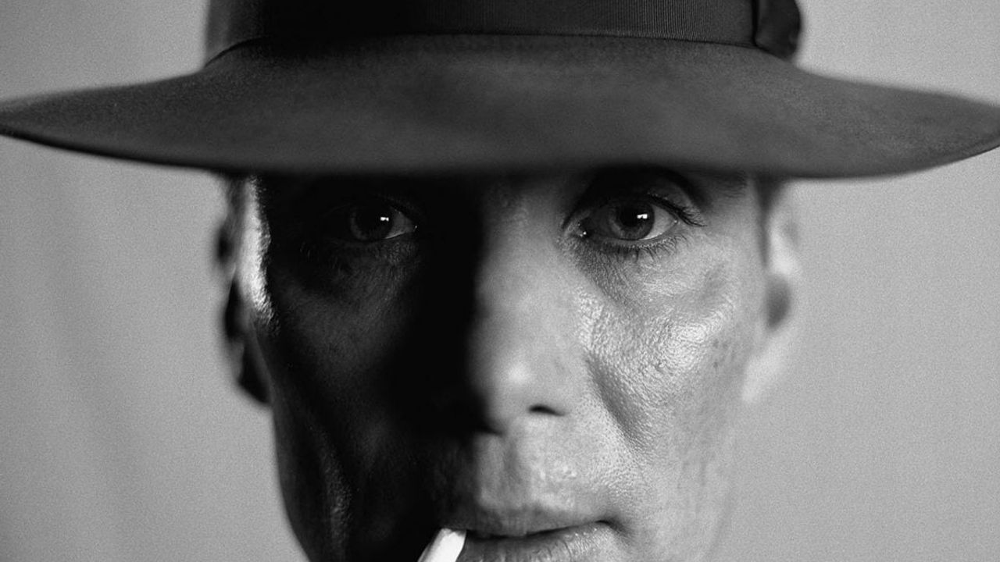

# Les personnages important

## Oppenheimer

### Une personnalité spécial

Oppenheimer est un homme brillant, passionné par la physique théorique, mais aussi tourmenté, introverti, et souvent en proie à des conflits moraux. Son regard est toujours en mouvement, comme son esprit. Il est charismatique mais distant, cérébral mais parfois émotionnellement inaccessible.

Il est fasciné par les idées, les concepts abstraits, l'art et la culture européenne. [Christopher Nolan](https://fr.wikipedia.org/wiki/Christopher_Nolan "Réalisateur de Oppenheimer") le montre comme un homme à la fois profondément idéaliste — notamment au début de sa carrière — et ensuite désabusé par l’impact de ses propres découvertes.

### Un Génie Scientifique

Le film met en avant son rôle central dans le projet Manhattan, en particulier à Los Alamos, où il coordonne la recherche sur la bombe atomique. Il est respecté (et parfois redouté) par ses collègues pour sa capacité à synthétiser des idées complexes et à prendre des décisions cruciales rapidement. Nolan montre un Oppenheimer scientifique, mais aussi stratège, meneur d’équipe malgré son manque d'expérience militaire ou administrative.

### Conflits Internes et Politiques

Une grande partie du film tourne autour de la tension entre sa contribution scientifique à la bombe et le poids de la culpabilité qu’il ressent après son utilisation à Hiroshima et Nagasaki. Ce dilemme le hante littéralement : les scènes subjectives dans lesquelles il voit des corps calcinés ou entend des cris de souffrance illustrent ses remords.

Le film explore aussi ses liens avec le Parti communiste dans les années 1930, et comment cela le rattrape dans les années 1950 lors de la célèbre audition pour retirer sa habilitation de sécurité. On y voit un homme traqué, utilisé puis trahi par l’appareil politique américain qu’il a pourtant servi.

### Vie personnelle 

Nolan montre également ses relations complexes avec les femmes — notamment avec sa femme Kitty (jouée par Emily Blunt), une ancienne militante alcoolique, et Jean Tatlock (Florence Pugh), une psychiatre communiste avec qui il entretient une liaison intense et tragique. Ces relations ne sont jamais idéalisées : elles font partie de son humanité, de ses paradoxes.

### Vision de Nolan

Nolan adopte un style très subjectif, en plongeant littéralement dans l’esprit d’Oppenheimer. Il utilise le noir et blanc pour les scènes « objectives » (notamment les procès et enquêtes), et la couleur pour celles « subjectives » — un moyen de montrer que le film est autant une biographie qu’une exploration psychologique.

***

Oppenheimer est montré comme un homme à la fois génial et brisé, admiré puis rejeté, hanté par ce qu’il a contribué à créer. Une citation du film résume bien son personnage :

> « Now I am become Death, the destroyer of worlds. »

C’est un personnage tragique, presque shakespearien, et Nolan (avec la performance magistrale de Cillian Murphy) en fait un protagoniste inoubliable.

***

## Lewis Strauss

Lewis Strauss (à prononcer "Straws") est un homme politique, homme d’affaires et ancien président de la Commission de l’énergie atomique (AEC). Le film le montre comme quelqu’un de calculateur, charismatique, intelligent, mais aussi rancunier et manipulateur.

Il est introduit comme un allié potentiel d’Oppenheimer, mais on découvre peu à peu qu’il est l’architecte en coulisse de sa chute.

### Son rôle dans l'intrigue

Lewis Strauss (à prononcer "Straws") est un homme politique, homme d’affaires et ancien président de la Commission de l’énergie atomique (AEC). Le film le montre comme quelqu’un de calculateur, charismatique, intelligent, mais aussi rancunier et manipulateur.

Il est introduit comme un allié potentiel d’Oppenheimer, mais on découvre peu à peu qu’il est l’architecte en coulisse de sa chute.

### Une personnalité peu scrupuleuse
Strauss est un homme très « Washingtonien » :

- Il sait manier la politique, les alliances, les coups bas.
- Il a une façade polie, voire affable, mais il nourrit des rancunes profondes.
- Il veut le pouvoir, la reconnaissance, et il ne supporte pas qu’Oppenheimer lui fasse de l’ombre intellectuellement ou socialement.

Le film en fait une figure du système américain paranoïaque de la Guerre froide, celui qui détruit ses héros pour les contrôler ou les faire taire.

### Face à Oppenheimer

Strauss et Oppenheimer sont opposés sur presque tout :

- Science vs politique
- Morale vs pragmatisme
- Vision long terme vs pouvoir immédiat

Leur conflit culmine dans les scènes de procès, superbement montées, où on réalise peu à peu que Strauss est derrière toute l’humiliation publique qu’a subie Oppenheimer.

### Une sacrée performance de Robert Downey Jr.

Robert Downey Jr. livre une performance nuancée, froide, magistrale. Il est presque méconnaissable : pas de glamour, pas de sarcasme à la Tony Stark, juste un homme vieillissant, frustré, et dangereux dans sa banalité.

Nolan l'utilise brillamment :

- D’abord discret, en arrière-plan.
- Puis peu à peu central, jusqu’à devenir le vrai révélateur de la tragédie d’Oppenheimer.
 
***
Lewis Strauss dans Oppenheimer, c’est :

- **L’Amérique qui tourne le dos à ses génies quand ils deviennent gênants.**
- **L’exemple d’un pouvoir silencieux, méthodique, et vindicatif.**
- Un personnage politique, mais presque shakespearien, comme un Iago moderne dans une tragédie de savants.

Il incarne une époque où les guerres ne se gagnent plus uniquement avec des bombes, mais avec des auditions à huis clos et des dossiers classés secret défense.
